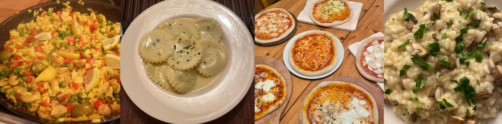
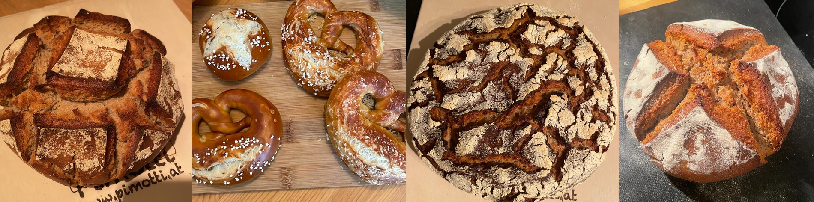
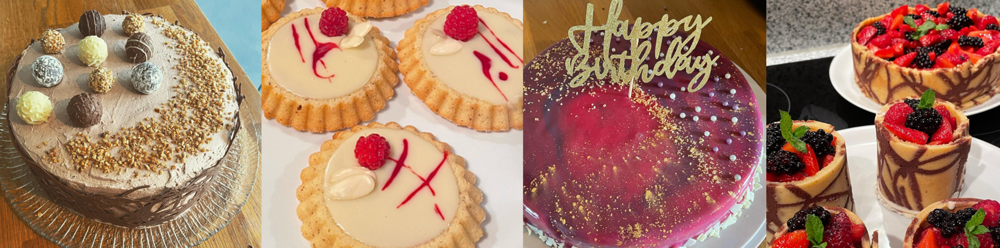

# li5akn.github.io
<!DOCTYPE html>
<html lang="en">
<head>

    <meta charset="UTF-8">    
    <meta name="viewport" content="width=device-width, initial-scale=1">
    
    <link href="https://cdn.jsdelivr.net/npm/bootstrap@5.1.3/dist/css/bootstrap.min.css" rel="stylesheet" integrity="sha384-1BmE4kWBq78iYhFldvKuhfTAU6auU8tT94WrHftjDbrCEXSU1oBoqyl2QvZ6jIW3" crossorigin="anonymous">
    
    <link rel="stylesheet" type="text/css" href="css/capstone.css">
    <title>Lisas Kitchen</title>

</head>

<body>
    <header>
        <h1>Lisa's Kitchen</h1>
    </header>

<!-- Carousel -->

    <!-- Indicators/dots -->
    

      <button type="button" data-bs-target="#demo" data-bs-slide-to="0" class="active"></button>
      <button type="button" data-bs-target="#demo" data-bs-slide-to="1"></button>
      <button type="button" data-bs-target="#demo" data-bs-slide-to="2"></button>
    

    
    <!-- The slideshow/carousel -->
    

      

        
        

        

      

      

        
        

       
 
      

      

        
        

        
  
      

    

    
    <!-- Left and right controls/icons -->
    <button class="carousel-control-prev" type="button" data-bs-target="#demo" data-bs-slide="prev">
      
    </button>
    <button class="carousel-control-next" type="button" data-bs-target="#demo" data-bs-slide="next">
      
    </button>

<!--navbar-->
<nav class="navbar navbar-expand-lg navbar-dark bg-dark">
  

    <button class="navbar-toggler" type="button" data-bs-toggle="collapse" data-bs-target="#navbarSupportedContent" aria-controls="navbarSupportedContent" aria-expanded="false" aria-label="Toggle navigation">
      
    </button>
    

      <ul class="navbar-nav me-auto mb-2 mb-lg-0">
        <li class="nav-item">
          <a class="nav-link active" aria-current="page" href="index.html">Home</a>
        </li>
        <li class="nav-item dropdown">
          <a class="nav-link dropdown-toggle" id="navbarDropdown" role="button" data-bs-toggle="dropdown" aria-expanded="false">
            Foods
          </a>
          <ul class="dropdown-menu dropdown-menu-dark" aria-labelledby="navbarDropdown">
            <li><a class="dropdown-item" href="dishes.html">Dishes</a></li>
            <li><a class="dropdown-item" href="sweets.html">Sweets & Cakes</a></li>
            <li><a class="dropdown-item" href="bread.html">Breads & Side Dishes</a></li>
          </ul>
          <li class="nav-item">
            <a class="nav-link" href="contact.html">Contact</a>
          </li>
        </ul>
    

  

</nav>

    

<main class="col-9 d-inline-block col-md-10">
    <h2>Welcome</h2>
    
Hi, I'am Lisa and I love food, just like most people. 
      Since I was child I also loved cooking.
      When the covid pandemic hit, I started baking as well. I learned it from going to some online classes. 
      Last months I learnd something complete different too: HTML and CSS Coding. Now I'm trying to combine those two hobbies. I wanna show you some of my favorite food creations on the first homepage I've made. But beware! If you're looking for healthy stuff you're totally wrong on this page.
      Hope you enjoy and may find some inspiration.

</main>  

<figure class="col-3 d-inline-block col-md-2"> 
    
    <figcaption>Summer 2021</figcaption>
</figure>

    

    <footer>- LisaKn / 2022 -</footer>

    

</body>

</html>
